# How to contribute

For now, feel free to [create an issue](https://github.com/OS2lab/os2ID/issues/new) concerning all types of chores, input, ideas, inspirations and critique.
Likewise get in touch by creating an issue with your question and tag the relevant project member.

## Current project state
This project is in its infant stages, still defining ist core architecture, contribution guidelines will change and improve as we move along.

```mermaid
gantt
    title 🗺️ Roadmap
    dateFormat  YYYY-MM-DD
    section 📋 Planning
    Consensus       :a1, 2023-10-12, 30d
    section 🚀 Initialization
    Repository setup           :2023-10-18, 10d
    section ✏️ Design
    Core Architecture plan  :2023-10-23, 30d            
```

