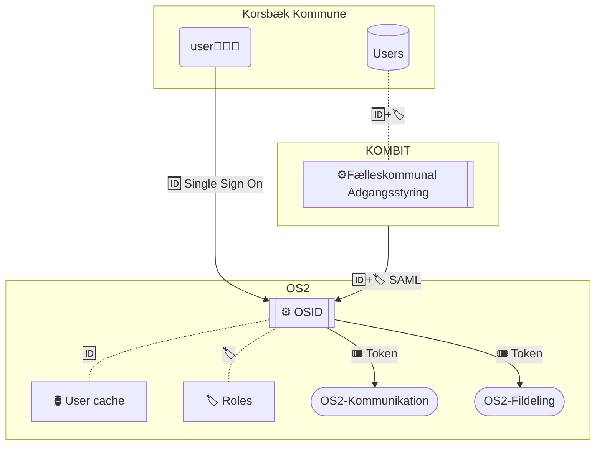

# 🪪 sandbox-myndighedsidentitet
## Identity management based on open standards

A modern identity and access management project, built for the cloud that provides Single Sign-On across OS2 delivered web-services.
### 🗓️ Roadmap
Check out where we are, what issues we are working on and when we estimate we are done with the defined milestones:

[Roadmap with milestones and due dates](https://github.com/OS2lab/os2ID/milestones?direction=desc&sort=completeness&state=open)

## Based on upstream project:
https://github.com/OS2sandbox/sandbox-myndighedsidentitet-authentik

### 🔀 Dataflow

## 📚 Documentation

#### 🗂️ Project description:
  [🇬🇧 in english](/docs/project_description.md#-os2id---identity-and-accessmanagent)
  
  [🇩🇰 in danish](/docs/project_description.md#-os2id---identitets--og-adgangsstyring)
  
  [🧩 High level architecture](/docs/High_Level_Architecture.md)
 
---
🎁 [How to contribute](CONTRIBUTING.md)

⚖️ [CODE OF CONDUCT (in danish for now)](https://github.com/OS2offdig/about/blob/main/CODE_OF_CONDUCT.md)
