# 🪪 sandbox-myndighedsidentitet
*Identity management based on open standards*
---
The upstream project [Authentik](https://github.com/goauthentik/authentik/) has been chosen as the core upstream component for this solution.

### 🅰️ Why Authentik?
*Authentik is an Open source identity and sso provider that prioritizes security and control of your most sensitive data.*

##### Design and Integration
Authentik is designed around a loosely coupled design, and has built in abilities to bridge legacy protocols to modern equivalents like OpenID Connect. Its focus on reusing modern standard stack components such as databases and cache solutions makes it a strong choice for an upstream Open Source solution.

##### Developer Efficiency
Using Authentik reduces the need for extensive in-house coding and maintenance and simplifies development by providing ready-made, secure authentication and authorization. This approach frees developers to focus on core business functionalities instead of reinventing and maintaining general infrastructure components.

##### Cost and Compliance
Adopting Authentik cuts development and maintenance costs and ensures compliance with industry standards, enhancing overall security and reliability.

##### Community and Support
[Continuous updates from the open source community](https://github.com/goauthentik/authentik/pulse) ensure that the business can adapt quickly to evolving security requirements and benefit from the expertise of a large community of specialists contributing to the project.

##### Security
Authentik’s security measures include thorough pentesting, [responsible disclosure policies](https://github.com/goauthentik/authentik/security), and [continuous updates to address vulnerabilities](https://github.com/goauthentik/authentik/pulse). These robust practices ensure a high level of trust and compliance, minimizing potential security breaches and reducing associated downstream maintenance and patching costs.

### 🗓️ Roadmap
Check out where we are, what issues we are working on and when we estimate we are done with the defined milestones:

[Roadmap with milestones and due dates](https://github.com/OS2lab/os2ID/milestones?direction=desc&sort=completeness&state=open)

### 🔀 Dataflow

```mermaid

graph TD

subgraph OS2
    OS2ID[["⚙️ OSID"]]-.-|"🆔"|Users["🛢 User cache"]
    OS2ID[["⚙️ OSID"]]-.-|"🏷️"|Roles["🏷️ Roles"]
    Applikation1([OS2-Kommunikation])
    Applikation2([OS2-Fildeling])
end

subgraph KK[Korsbæk Kommune]
UserStore[("Users")]
User
end

subgraph KOMBIT
fkadg[[" ⚙️Fælleskommunal Adgangsstyring"]]
end

KOMBIT-->|"🆔+🏷️ SAML"|OS2ID

User("user👩🏻‍💻")-->|"🆔 Single Sign On"|OS2ID-->|" 🎟️ Token"|Applikation2 & Applikation1
UserStore-.-|"🆔+🏷️"|fkadg

```

## 📚 Documentation

#### 🗂️ Project description:
  [🇬🇧 in english](/docs/project_description.md#-os2id---identity-and-accessmanagent)
  
  [🇩🇰 in danish](/docs/project_description.md#-os2id---identitets--og-adgangsstyring)
  
  [🧩 High level architecture](/docs/High_Level_Architecture.md)
 
---
🎁 [How to contribute](CONTRIBUTING.md)

⚖️ [CODE OF CONDUCT (in danish for now)](https://github.com/OS2offdig/about/blob/main/CODE_OF_CONDUCT.md)
