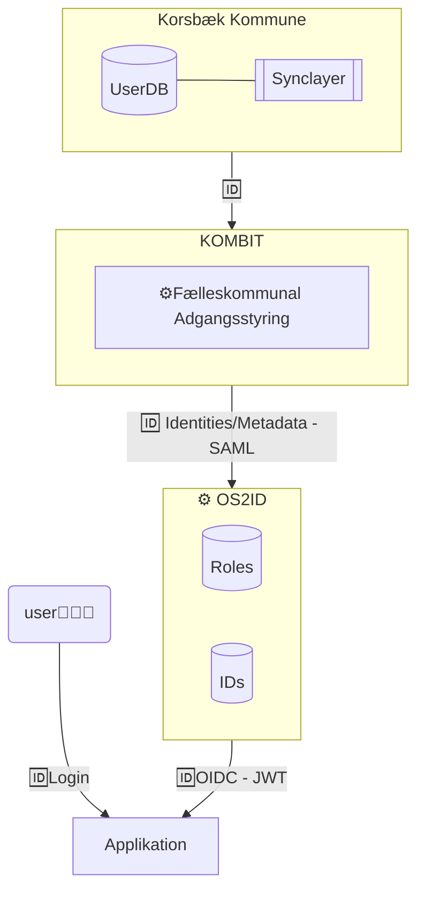

## Dataflow and component archihtecture

```mermaid
graph TD

subgraph OS2ID["⚙️ OS2ID"]
Roles[(Roles)]
IDs[(IDs)]
end

subgraph KK[Korsbæk Kommune]
UserStore[(UserDB)]---Sync[[Synclayer]]
end

subgraph KOMBIT
fkadg[" ⚙️Fælleskommunal Adgangsstyring"]
end

KK-->|"🆔"|KOMBIT-->|"🆔 Identities/Metadata - SAML"|OS2ID-->|"🆔OIDC - JWT"|Applikation

user("user👩🏻‍💻")-->|"🆔Login"|Applikation
```
