# High level architecture

### This diagram provides a clear view of how applications interact with the OS2ID service and how the OS2ID service communicates with the Identity Providers  endpoints through the Middleware component.

```mermaid
graph RL

subgraph B[OS2ID]
    B1[(ids)]---|⚙|E[User\nManagement]
end
    A1[Application 1] --> B
    A2[Application 2] --> B
    A3[Application 3] --> B
    A4[Application 4] --> B
    A5[Application 5] --> B
    B --> D[Middleware]
    B --> C1[Identiteter]
    B --> C2[Identiteter]
    D -->|Legacy API|C3[Identiteter \n Legacy IDP]
    U[👤\nAdmin] -->B
```

