# High level architecture

### This diagram provides a clear view of how applications interact with the OS2ID service and how the OS2ID service communicates with the Identity Providers either directly og through Middleware components that handles legacy IDPs.

```mermaid
graph LR

subgraph B[OS2ID]
    B1[(ids)]---|"⚙"|E["User <br> Management"]
end
    A1[Application 1] -->|Token| B
    A2[Application 2] -->|Token| B
    A3[Application 3] -->|Token| B
    A4[Application 4] -->|Token| B
    A5[Application 5] -->|Token| B
    B -->|API| D[Middleware]
    B -->|API| C1[Identiteter]
    B -->|API| C2[Identiteter]
    D -->|Legacy API|C3["Identiteter <br> Legacy IDP"]
    U["👤Admin"] -->|Web| B
```

---

### Used terms: 

*IDP:* [Identity provider](https://en.wikipedia.org/wiki/Identity_provider)

*API*: [Application Programming Interface](https://en.wikipedia.org/wiki/API#1960s_and_1970s)

*Token*: [Non-sensitive access method](https://en.wikipedia.org/wiki/Tokenization_(data_security))

*Legacy API:* APIs with older standards like [SOAP](https://www.w3.org/TR/soap/)

*Middleware:* [A component that bridges different standards](https://en.wikipedia.org/wiki/Middleware)
